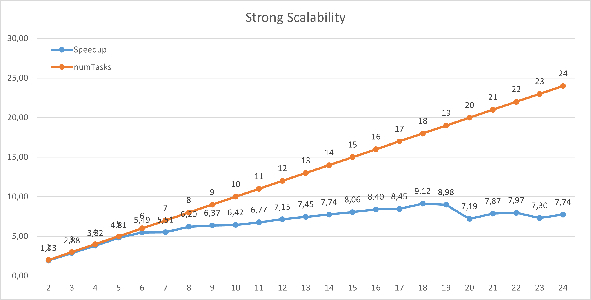

# wordCount
Un semplice programma che esegue il conteggio delle occorrenze di ogni parola all'interno di uno o più file in modo parallelo utilizzando OpenMPI e C
## Info generale
<i>Nome</i>: Vincenzo <br>
<i>Cognome</i>: Malafronte <br>
<i>Matricola</i>: 0522501522 <br>
<i>Sistema di benchmarking</i>: Cluster gcloud composto da 4 istanze di VM E2-standard-4 con 4 vCPU e 10GB di memoria <br>
## Indice
  1. Breve descrizione del problema
  2. Descrizione dell'implementazione
     * Divisione del carico
     * Conteggio delle occorrenze delle parole
     * Fusione dei risultati e ordinamento
  3. Info per l'esecuzione
  4. Test
  5. Benchmarking
     * Strong Scalability 
     * Weak Scalability
  6. Analisi dei risultati e conclusioni
## Breve descrizione del problema 
Il problema del Word Count riguarda il conteggio del numero di parole in un documento o in un file di testo generico. L'utilizzo del Word Counter può essere necessario quando un testo deve rimanere entro un determinato numero di parole come ad esempio: nel caso del mondo accademico, nei procedimenti legali, nell'ambito giornalistico o pubblicitario; può essere anche utilizzato dai traduttori per determinare il prezzo di un lavoro di traduzione.
E' stata fatta una semplice implementazione del Word Count in MPI durante il corso di "Programmazione Concorrente e Parallela sul Cloud" (PCPC - 0522500102) all'Università degli studi di Salerno.

L'obiettivo di questo progetto riguarda la creazione di un applicativo che realizzi il conteggio delle parole in modo parallelo tra più processi usando la libreria OpenMPI. Viene utilizzata questa implementazione per eseguire il conteggio delle parole su un gran numero di file; introduciamo il problema dividendolo in varie fasi:

1. Il processo MASTER avrà l'elenco di tutti i file da leggere all'interno di una directory. E' importante specificare che solo 1 dei processi leggerà l'elenco dei file. Quindi ciascuno dei processi riceverà la propria "parte" del file dal processo MASTER. Dopo che un processo ha ricevuto il suo elenco di file da elaborare, effettuerà quindi la lettura di ciascuno dei file per poi eseguire il conteggio delle parole, tenendo traccia ovviamente della frequenza con cui si verifica ogni parola trovata nei file. Chiameremo l'istogramma prodotto l'istogramma locale.
2. La seconda fase consiste nella produzione dell'istogramma locale che permetterà di combinare le frequenze delle parole per ogni processo. Ad esempio, la parola "ciao" potrebbe essere contata più volte in processi diversi, quindi alla fine si sommeranno tutte queste occorrenze.
3. L'ultima fase prevede che ciascuno dei processi invii i propri istogrammi locali al processo MASTER, che avrà solo bisogno di raccogliere tutte queste informazioni. Ovviamente ci saranno parole duplicate tra i processi, quindi il MASTER dovrebbe creare un file in formato .csv in ordine decrescente in base alla frequenza delle parole e, a parità di quest'ultima, in ordine alfabetico.
## Descrizione dell'implementazione
L'implementazione si basa sull'utilizzo di una HashMap(crediti a https://github.com/benhoyt/ht per l'implementazione), la quale permette di associare ad ogni <i>key</i>(la parola trovata), un <i>value</i>(le occorrenze) e che permette laccesso alle entry in tempo costante, il che aumenta le prestazioni. Per la risoluzione dei conflitti è stato adottato il principio di linear probing che funziona in questo modo: se si sta cercando di inserire un elemento ma ce n'è già uno, è sufficiente andare direttamente allo slot successivo, sfruttando il concetto di locality della cache, risultando più efficiente.
Verrà istanziata una HashTable per ogni processo, che conterrà ovviamente le parole e il numero di occorrenze che ogni processo è riuscito a trovare.
La soluzione si divide in vari passaggi:
* Come prima cosa il MASTER leggerà tutta la directory e ne prenderà tutte le informazioni necessarie per la lettura e la distribuzione, poi quindi calcolerà il carico per ogni processo e lo invierà in una struttura creata per la distribuzione.
* Una volta ricevuta la distribuzine ogni processore legge i file e ne conta le parole, nel caso in cui non legga il file per intero e, quindi, ci possa essere una parola a cavallo tra due processori, sraà il processore che ha già iniziato a leggerla ad inserirla nella propria table.
* Una volta contate le parole, ogni processo invia la propria tabella al MASTER che provvederà a unirle tutte e ordinarle per occorrenze e, in caso di stessa occorrenza, per ordine alfabetico.
* Finito il merge delle tabelle il MASTER provvede a scrivere i risultati su un file output<numtasks>.csv.
### Divisione del carico
Prima di iniziare lo sviluppo della soluzione è stato necessario definire come prendere i file da leggere e dove inserire le informaazioni relative ad esse. E' stata creta una struttura dati <code>Info</code> definita come mostrato di seguito, riempita dalla funzione <code>getInfo()</code> che va a leggere tutti i file nella directory <code>./files</code>. 
```c
typedef struct {            //informazioni sulla directory
    int n;                  //numero di file nella directory
    int *dims;              //dimensione di ogni file
    int *restDim;
    char **names;            //array dei nomi     
} Info;

Info getInfo(){   
    int numelem = 5;
    DIR *d;
    struct dirent *dir;
    struct stat buf;
    char path[DIRECTORY];
    Info i;
    i.n = 0;
    i.dims = malloc(numelem * sizeof(int));
    i.restDim = malloc(numelem * sizeof(int));
    i.names = malloc(numelem * MAX_NAME * sizeof(char));
    strcat(getcwd(path, DIRECTORY), "/files");
    chdir(path);

    if (!(d = opendir(path))) {
        fprintf(stderr, "[ERROR] Impossibile aprire la directory\n");
        exit(0);
    }
    while ((dir = readdir(d)) != NULL) {   
        stat(dir->d_name, &buf);
            
        if(!S_ISDIR(buf.st_mode))  {  
            i.names[i.n] = malloc(sizeof(char) * strlen(dir->d_name) + 1);
            strcpy(i.names[i.n], dir->d_name);
            i.dims[i.n] = buf.st_size;
            i.restDim[i.n] = buf.st_size; 
            i.n += 1;
        }

        if (i.n == numelem){
            numelem += 1;
            i.dims = realloc(i.dims, numelem * sizeof(int));
            i.restDim = realloc(i.restDim, numelem * sizeof(int));
            i.names = realloc(i.names, numelem * MAX_NAME * sizeof(char));
        }
    }
    closedir(d);
    return i;
}
```

Una volta presi dati relativi i files si è proceduto con il calcolo della distribuzione. Anche in questo caso è stata creata una struttura dati <code>DataDistr</code>, definita dal MASTER per ogni processore e poi inviata tramite una <code>MPI_Scatter</code>. La struttura contiene il numero di files assegnati al processore, poi tre array di interi che conterranno:
* l'indice del nome del file da leggere
* il fd da cui iniziare a leggere(relativo al file ovviamente)
* il fd in cui stopparsi.
Una volta definite le strutture utilizzate si può passare alla fase di distribuzione. Per distribuire i dati si utilizza la funzione <code>distribute()</code>. Questa funzione come prima cosa calcola il numero di bytes che ogni processore deve leggere, facendo una divisione della somma di tutti i files per tutti i processori, poi assegna l'approssimazione per difetto al master e l'approssimazione per eccesso a tutti gli altri processori. Presa la size, per ogni processore vengono definiti gli offset di inizio e fine per ogni processore, calcolati utililzzando la size definita prima. Di seguito la struttura dati con la funzione distribute() e setSize().

```c
typedef struct {            //da creare come array di nproc, ogni istanza
    int nFile;              //avrà le informazioni relative al carico di quel processo
    int indexFiles[SIZE];
    int startFd[SIZE];
    int endFd[SIZE];
    int size;
} DataDist;

void distribute(DataDist *struc, Info info, int numtasks){
    int somma = sommaDims(info.dims, info.n), 
        mediaFiles = myCeil((double)info.n/numtasks),
        count, tot;          //Contatore universale per i file in info 

    setSize(struc, somma, numtasks);
    //setSizeWS(struc, somma, numtasks);

    /*  ------------- Fine Distribzione dei valori ---------------- */
    /*  ----------------- Distribzione dei file ------------------- */
    /*
        Indici:
        i -> per i processori
        j -> per i file dei processori
        count -> per i file in Info
    */
    count = 0;

    for(int i = 0; i < numtasks ; i++){      //Ciclo per i processori 
        struc[i].nFile = 0;
        for(int j = 0; struc[i].size != 0 && count < info.n; j++){      //Ciclo per assegnare i file ai processori

            struc[i].indexFiles[j] = count;
            //  Start FD:
            if(info.restDim[count] == info.dims[count])     //Se il file ancora non è stato diviso
                struc[i].startFd[j] = 0;
            else                                        //Il file è gia stato diviso
                struc[i].startFd[j] = struc[i-1].endFd[struc[i-1].nFile - 1] + 1; //dimensione iniziale - dimensione rimanente + 1 = punto di partenza da cui leggere
            struc[i].size--; 
            info.restDim[count]--;
            
            //  EndFd
            if(struc[i].size >= info.restDim[count]){
                struc[i].endFd[j] = EOF;
                struc[i].size -= info.restDim[count];
                //somma += info.restDim[count];
                info.restDim[count] = 0;
                count++;
            } else {
                struc[i].endFd[j] = struc[i].startFd[j] + struc[i].size;
                info.restDim[count] -= struc[i].size;
                //somma += struc[i].size;
                struc[i].size = 0;
            }
            //  file aggiunto
            struc[i].nFile += 1;
        }   
    }
    setSize(struc, somma, numtasks); 
}

void setSize(DataDist *d, int sum, int numtasks){
    for (int j = 0; j < numtasks; j++){
        if(j != MASTER)
            d[j].size = myCeil((double)sum/numtasks);
        else
            d[j].size = myfloor((double)sum/numtasks);
    }
}
```
Con questo sono state definite le strutture dati e le funzioni utilizzate per la distribuzione del carico. Ora passiamo alla definizione del programma cheeseguirà il conteggio. Come prima cosa tutti i processi inizializzano una hashTable in cui inserire il conteggio delle parole e un array di stringhe in cui inserire i nomi dei files, il MASTER definisce un array di dataDistr di lunghezza <code>numtasks</code>, nel quale inserirà i risultati della funzione <code>distribute()</code>, e crea un MPI_Datatype da usare per passare la distribuzione in modo più ottimale.
```C
ht *counts = ht_create();
//---------------- Creo il datatype per la distribuzione dei dati ----------------------------	
    MPI_Datatype MPI_DATA_DISTR;
    int lengths[5] = {1, SIZE, SIZE, SIZE, 1};
    MPI_Datatype types[5] = {MPI_INT, MPI_INT, MPI_INT, MPI_INT, MPI_INT};
    MPI_Aint base_address, displacements[5];
    DataDist dummyDataDistribution;

    MPI_Get_address(&dummyDataDistribution, &base_address);
    MPI_Get_address(&dummyDataDistribution.nFile, &displacements[0]);
    MPI_Get_address(&dummyDataDistribution.indexFiles, &displacements[1]);
    MPI_Get_address(&dummyDataDistribution.startFd, &displacements[2]);
    MPI_Get_address(&dummyDataDistribution.endFd, &displacements[3]);
    MPI_Get_address(&dummyDataDistribution.size, &displacements[4]);

    for(int i = 0; i < 5; i++)
        displacements[i] = MPI_Aint_diff(displacements[i], base_address);

    MPI_Type_create_struct(5, lengths, displacements, types, &MPI_DATA_DISTR);
    MPI_Type_commit(&MPI_DATA_DISTR);
```
Creato il datatype, il MASTER inizia a calcolare la distribuzione e la manda a tutti i processi tramite una <code>MPI_Scatter</code> e invia l'array dei nomi dei files con il numero di file totali nella directory tramite una <code>MPI_Bcast</code>
```C
if(myrank == MASTER){
	DataDist tmpDistr[numtasks];
	i = getInfo();

	for(int j = 0; j < i.n; j++)
		strcpy(names[j], i.names[j]);
	nfiles = i.n;
	distribute(tmpDistr, i, numtasks);
	MPI_Scatter(&tmpDistr[0], 1, MPI_DATA_DISTR, &mydistr, 1, MPI_DATA_DISTR, MASTER, MPI_COMM_WORLD);
	free(i.dims);
	free(i.names);
	free(i.restDim);
}else 
	MPI_Scatter(NULL, 1, MPI_DATA_DISTR, &mydistr, 1, MPI_DATA_DISTR, MASTER, MPI_COMM_WORLD);
	
MPI_Bcast(&nfiles, 1, MPI_INT, MASTER, MPI_COMM_WORLD);
MPI_Bcast(names, nfiles * MAX_NAME, MPI_CHAR, MASTER, MPI_COMM_WORLD);

```
### Conteggio delle parole
Dal momento in cui ricevono tutte le informazioni relative al carico di lavoro, i processori iniziano a contare le parole. Come prima cosa aprono i file e controllano come dovranno leggere, infatti:
* Nel caso in cui il file non debba essere letto dall'inizio(<code>startFd!=0</code>) allora bisognerà fare una fseek al punto di inizio e si dovrà controllare che non ci sia una parola divisa, quindi se il carattere relativo al byte di inizio è una lettera si controlla il precedente e, nel caso in cui sia ancora una lettera, si cicla fino al primo carattere dopo la fine della parola
```c
if(mydistr.startFd[i] != 0)	{		//controlla se il carattere precedente è un char
	fseek(fp, mydistr.startFd[i] - 1, SEEK_SET);
	if(ischar(fgetc(fp))){			//se è un char allora skippa la parola
		fseek(fp, -2, SEEK_CUR);
		while(ischar(fgetc(fp)))
			;
	}
}	
```
* Nel caso in cui il file non debba essere letto fino alla fine allora durante l'esecuzione bisogna controllare se ci sono ancora abbastanza caratteri per continuare la lettura per blocchi di ROW(4096) e nel caso in cui non ce ne siano a sufficienza bisogna inserire il numero rimanente da leggere. In più, alla fine del conteggio bisogna controllare se c'è una parola non complete e, nel caso, bisogna completarla.
```c
if((mydistr.endFd[i] - ftell(fp)) < row){
	row = mydistr.endFd[i] - ftell(fp);
}	//se il valore della riga che ho inserito è minore dei bytes che devo leggere allora mi segno quanto leggere
while(fgets(buffer, row, fp) != NULL){
	for(int k = 0; k < strlen(buffer); k++){
		if(ischar(buffer[k]))
			wordToAdd[j++] = buffer[k];
		else{
			wordToAdd[j] = '\0';
			if(strlen(wordToAdd) > 0){
				insertWord(counts, wordToAdd, 1);
			}
			strcpy(wordToAdd, "");
			j = 0;
		}
	}// end for
			
	if(((mydistr.endFd[i] - ftell(fp)) < row)){
		row = mydistr.endFd[i] - ftell(fp);
	}
	if(row == 1){
		char ch = fgetc(fp);
		if(ischar(ch)){
			while(ischar(ch)){
				wordToAdd[j++] = ch;
				ch = fgetc(fp);
			}
			wordToAdd[j] = '\0';
			if(strlen(wordToAdd) > 0){
				insertWord(counts, wordToAdd, 1);
			}
			strcpy(wordToAdd, "");
			j = 0;
		} else {
			wordToAdd[j] = '\0';
			if(strlen(wordToAdd) > 0){
				insertWord(counts, wordToAdd, 1);
			}
			strcpy(wordToAdd, "");
			j = 0;
		} 
		break;
	}
}
```
* Nel caso in cui il file debba essere letto fino alla fine si legge per blocchi di ROW(4096) finchè la fgets non restituuisce <code>NULL</code>
```c
if(mydistr.endFd[i] == EOF){
	while(fgets(buffer, ROW, fp) != NULL){
		for(int k = 0; k < strlen(buffer); k++){
			if(ischar(buffer[k])) 	wordToAdd[j++] = buffer[k];
			else {
				wordToAdd[j] = '\0';
				if(strlen(wordToAdd) > 0){
					insertWord(counts, wordToAdd, 1);
				}
				j = 0;
				strcpy(wordToAdd, "");
			}
		}
	}
	fclose(fp);
}
```
### Fusione dei risultati e ordinamento
A questo punto, ogni processo ha la sua HashTable con le sue parole. Ciò che faranno i processi ora è impacchettare i dati letti in un buffer (tramite la funzione MPI_Pack()), che verrà mandato al processo MASTER tramite una MPI_Gatherv(). Prima di ciò, viene effettuata una MPI_Gather(), che permetterà al processo MASTER di sapere quanto sono grandi le tabelle di ogni processo, in modo tale da prepararsi a ricevere tutti i dati da tutti i processi. Viene utilizzata la struttura dati HashTableIterator, che permette di scorrere la tabella per prendere i valori contenuti in essa. 
```c
sizepack = sizeof(int) + (((sizeof(char) * wordlenght) + sizeof(int)) * ht_length(counts));
countpack = 4 + ((wordlenght + 4) * ht_length(counts));
position = 0;
numel = ht_length(counts) * (wordlenght + 4) + 4;
it = ht_iterator(counts);
hashsend = malloc(sizepack);
if(myrank == MASTER){	
	countselem  = malloc(numtasks * sizeof(int));
	dispelem = malloc(numtasks * sizeof(int));
}
MPI_Gather(&numel, 1, MPI_INT, countselem, 1, MPI_INT, MASTER, MPI_COMM_WORLD);
if(myrank == MASTER){	//se sei master preparati a ricevere la gatherv
	int tmp = 0;
	dispelem[0] = 0;
	sizetoreceive += countselem[0]; 	
	
	for(int i = 1; i < numtasks; i++){
		dispelem[i] = tmp + countselem[i-1];
		tmp += countselem[i-1];
		sizetoreceive += countselem[i];
	}
	htsreceived = malloc((sizetoreceive + 1) * sizeof(char));	
} else {	//altrimenti impacchettate i dati
	int length = ht_length(counts);
	MPI_Pack(&length, 1, MPI_INT, hashsend, sizepack, &position, MPI_COMM_WORLD);
	for(int i = 0; i < length; i++){
		ht_next(&it);
		int countword = *((int*) it.value);
		char key[wordlenght];
		strcpy(key, it.key);
		MPI_Pack(key, wordlenght, MPI_CHAR, hashsend, sizepack, &position, MPI_COMM_WORLD);
		MPI_Pack(&countword, 1, MPI_INT, hashsend, sizepack, &position, MPI_COMM_WORLD);
	}
}
MPI_Gatherv(hashsend, countpack, MPI_PACKED, htsreceived, countselem, dispelem, MPI_PACKED, MASTER, MPI_COMM_WORLD);
```
Fatto ciò il MASTER ha ricevuto tutti i dati e deve eseguire la <code>MPI_Unpack()</code> sui dati ricevuti. Man mano che spacchetta vengono analizzate le tabelle e inserite le parole all'interno della propria tabella. Finito questo passaggio manca solo riordinare la sua HashTable. Il riordinamento avviene in questo modo:
* Per fare in modo di non toccare la tabella, viene sfruttata una struttura dati d'appoggio chiamata MergedHashTable, che corrisponde semplicemente ad una entry di un HashTable;
* Viene dichiarato un array di questa struttura, grande quanto il numero di entry della HashTable, che poi viene riempito tramite l'HashTableIterator.
* Per finire viene applicato un algoritmo di mergeSort che riordina l'array secondo il numero di frequenze di ogni parola in ordine decrescente. A parità di frequenze, le parole vengono ordinate in ordine alfabetico.
```c
//Ordinamento
numEntries = ht_length(counts);
merged_ht* mergedTable = merged_ht_create(numEntries);

if (mergedTable == NULL)
	exit_nomem();

        // Struttura dati che permettere di scorrere gli elementi della Hash Table
htit = ht_iterator(counts);
int q = 0;

       // Riempio gli array per riordinarli (per evitare di toccare la HashTable)
while (ht_next(&htit)) {
	setword(mergedTable, htit.key, q);
        mergedTable[q].freq = *(int*) htit.value;
	q++;
}

      // Effettuo l'ordinamento
mergeSort(mergedTable, 0, numEntries - 1);
//-----------------------------------------------------------------------------------------------------
void merge(merged_ht* mergedTable, int l, int m, int r){
    int i, j, k;
    int n1 = m - l + 1;
    int n2 = r - m;

    // Vengono creati degli array temporanei
    int L1[n1], R1[n2];
    char L2[n1][WORD], R2[n2][WORD];
 
    // Vengono riempiti
    for (i = 0; i < n1; i++){
        strcpy(L2[i], mergedTable[l + i].word);
        L1[i] = mergedTable[l + i].freq;
    }
    for (j = 0; j < n2; j++){
        strcpy(R2[j], mergedTable[m + 1 + j].word);
        R1[j] = mergedTable[m + 1 + j].freq;
    }

    // Vengono uniti gli array temporanei negli array di partenza nella struttura dati
    i = 0; // Indice iniziale del primo sottoarray
    j = 0; // Indice iniziale del secondo sottoarray
    k = l; // Indice iniziale del sottoarray unito

    while (i < n1 && j < n2) {
        if (L1[i] > R1[j]) {
            strcpy(mergedTable[k].word, L2[i]);
            mergedTable[k].freq = L1[i];

            i++;
        }
        else if(L1[i] < R1[j]){
            strcpy(mergedTable[k].word, R2[j]);
            mergedTable[k].freq = R1[j];
            
            j++;
        } else {
            if(strcmp(L2[i], R2[j]) < 0){
                strcpy(mergedTable[k].word, L2[i]);
                mergedTable[k].freq = L1[i];

                i++;
            } else {
                strcpy(mergedTable[k].word, R2[j]);
                mergedTable[k].freq = R1[j];
                
                j++;
            }
        }
        k++;
    }
 
    // Vengono copiati gli elementi rimanenti del primo sottoarray, se ce ne sono
    while (i < n1) {
        strcpy(mergedTable[k].word, L2[i]);
        mergedTable[k].freq = L1[i];
        i++;
        k++;
    }
 
    // Vengono copiati gli elementi rimanenti del secondo sottoarray, se ce ne sono
    while (j < n2) {
        strcpy(mergedTable[k].word, R2[j]);
        mergedTable[k].freq = R1[j];
        j++;
        k++;
    }
}

void mergeSort(merged_ht* mergedTable, int l, int r){
    if (l < r) {
        // Uguale a (l+r)/2, ma evita l'overflow per l e h grandi
        int m = l + (r - l) / 2;
 
        // Ordiniamo ricorsivamente la prima e la seconda metà degli array
        mergeSort(mergedTable, l, m);
        mergeSort(mergedTable, m + 1, r);
        
        merge(mergedTable, l, m, r);
    }
}

```
## Info per l'esecuzione
Il codice è scritto su più file. Per eseguire il progetto basta eseguire:
```
make
mpirun --allow-run-as-root -np <numeroProcessori> ./main
```
Affinchè il codice funzioni è necessario avere i file in una cartella chiamata <code>files</code> che si trova all'interno della stessa cartella dell'eseguibile. Per essere più chiari, il progamma leggerà tutti i files che si trovano all'interno della cartella <code>./files</code>
## Test
Per testare il programma sono stati usati prima due file di piccole dimensioni in modo da controllare l'andamento in modo autonomo, poi è estato eseguito lo script <code>accuracy.sh</code> che esegue il programma fino a 24 processori e poi confronta i risultati con il file <code>oracle.csv</code>, se dopo l'esecuzione non stampa nulla allora non ha trovato differenze tra i due file. Di seguito lo script accuracy.sh.
```
make
mpirun --allow-run-as-root -np 1 ./main
mpirun --allow-run-as-root -np 2 ./main
mpirun --allow-run-as-root -np 3 ./main 
mpirun --allow-run-as-root -np 4 ./main
mpirun --allow-run-as-root -np 5 ./main 
mpirun --allow-run-as-root -np 6 ./main 
mpirun --allow-run-as-root -np 7 ./main 
mpirun --allow-run-as-root -np 8 ./main 
mpirun --allow-run-as-root -np 9 ./main 
mpirun --allow-run-as-root -np 10 ./main 
mpirun --allow-run-as-root -np 11 ./main 
mpirun --allow-run-as-root -np 12 ./main 
mpirun --allow-run-as-root -np 13 ./main 
mpirun --allow-run-as-root -np 14 ./main 
mpirun --allow-run-as-root -np 15 ./main 
mpirun --allow-run-as-root -np 16 ./main
mpirun --allow-run-as-root -np 17 ./main 
mpirun --allow-run-as-root -np 18 ./main 
mpirun --allow-run-as-root -np 19 ./main 
mpirun --allow-run-as-root -np 20 ./main 
mpirun --allow-run-as-root -np 21 ./main 
mpirun --allow-run-as-root -np 22 ./main 
mpirun --allow-run-as-root -np 23 ./main 
mpirun --allow-run-as-root -np 24 ./main 
cd output
diff oracle.csv output1.csv
diff oracle.csv output2.csv
diff oracle.csv output3.csv
diff oracle.csv output4.csv
diff oracle.csv output5.csv
diff oracle.csv output6.csv
diff oracle.csv output7.csv
diff oracle.csv output8.csv
diff oracle.csv output9.csv
diff oracle.csv output10.csv
diff oracle.csv output11.csv
diff oracle.csv output12.csv
diff oracle.csv output13.csv
diff oracle.csv output14.csv
diff oracle.csv output15.csv
diff oracle.csv output16.csv
diff oracle.csv output17.csv
diff oracle.csv output18.csv
diff oracle.csv output19.csv
diff oracle.csv output20.csv
diff oracle.csv output21.cs
diff oracle.csv output22.csv
diff oracle.csv output23.csv
diff oracle.csv output24.csv
cd ..
make clean
```
## Benchmarks
Per l'esecuzione del benchmark è stato utilizzato uno script <code>benchmark.sh</code> che semplicemente esegue il comando <code>mpirun --allow-run-as-root -np <nProc> ./main</code> 3 volte per ogni numero di processori(ai fini del progetto viene eseguito 3 volte per ogni nproc fino a 24 processori). Per valutare le prestazioni sono stati calcolati:
* Speedup, ovvero la riduzione del tempo di esecuzione di p processori (VCPUs) rispetto l'esecuzione su 1 processore. La formula usata è <code>Sp = Ts / Tp</code> in cui <code>Ts</code> sarebbe il tempo impiegato in sequenziale, <code>Tp</code> sarebbe il tempo impiegato con p processori.
* Strong Scalability, ovvero la velocizzazione per una dimensione fissa del problema con l'aumento del numero di processori, ed è stata testata eseguendo il codice su una dimensione costante del probema con un numero crescente di processori (VCPUs). L'efficienza della strong scalability è stata calcolata con la formula: <code>Ep = Sp / p</code>, in cui p sarebbe il numero di processori.
* Weak Scalability, ovvero la velocizzazione con un carico variabile al crescere del numero di processori (VCPUs). La formula per calcolare l'efficienza della weak scalability è <code>Ep = T1 / Tp</code> 
## Risultati
### Strong Scalability
#### Numero di files = 35
#### Size totale = 674MB =~ 674 milioni di caratteri
| # Processi |  Tempo(s) | Speedup | Efficienza |
|------------|-----------|---------|------------|
| 1          | 37.087123 |     -   |      -     |
| 2          | 19.240697 |   1.93  |    0.96    |
| 3          | 12.887738 |   2.88  |    0.96    |
| 4          |  9.713964 |   3.82  |    0.95    |
| 5          |  7.706488 |   4.81  |    0.96    |
| 6          |  6.757697 |   5.49  |    0.91    |
| 7          |  6.731337 |   5.51  |    0.79    |
| 8          |  5.981004 |   6.20  |    0.78    |
| 9          |  5.822867 |   6.37  |    0.71    |
| 10         |  5.773882 |   6.42  |    0.64    |
| 11         |  5.478600 |   6.77  |    0.62    |
| 12         |  5.189586 |   7.15  |    0.60    |
| 13         |  4.979064 |   7.45  |    0.57    |
| 14         |  4.788784 |   7.74  |    0.55    |
| 15         |  4.603424 |   8.06  |    0.54    |
| 16         |  4.414850 |   8.40  |    0.53    |
| 17         |  4.388429 |   8.45  |    0.50    |
| 18         |  4.065682 |   9.12  |    0.51    |
| 19         |  4.127842 |   8.98  |    0.47    |
| 20         |  5.158907 |   7.19  |    0.36    |
| 21         |  4.714741 |   7.87  |    0.37    |
| 22         |  4.653370 |   7.97  |    0.36    |
| 23         |  5.077088 |   7.30  |    0.32    |
| 24         |  4.788971 |   7.74  |    0.32    |
<br>

Come si può notare dalla tabella al crescere dei processori abbiamo una notevole diminuzione del tempo di esecuzione, che in termini di speedup significa 9.12 nel suo massimo, anche se l'efficienza è 0,51. Infatti non sempre minor tempo significa migliori prestazioni, nel caso di 18 processori(vCPU) ci si aspetterebbe uno speed up di 18 appunto, per questo calcoliamo l'efficienza la quale ci dice che per la scalabilità forte le performance migliori le abbiamo con 2, 3, 4 e 5 processori

| # Processi | Tempo(s) | Efficienza |
|------------|----------|------------|
| 1          | 2.519285 |      -     |
| 2          | 2.646571 |    0.95    |
| 3          | 2.560877 |    0.98    |
| 4          | 2.736415 |    0.92    |
| 5          | 2.919280 |    0.86    |
| 6          | 2.881948 |    0.87    |
| 7          | 3.228793 |    0.78    |
| 8          | 3.415889 |    0.74    |
| 9          | 3.655438 |    0.69    |
| 10         | 3.919958 |    0.64    |
| 11         | 4.132246 |    0.61    |
| 12         | 4.192555 |    0.60    |
| 13         | 4.979064 |    0.51    |
| 14         | 4.680085 |    0.54    |
| 15         | 4.997366 |    0.50    |
| 16         | 5.182972 |    0.49    |
| 17         | 6.388140 |    0.39    |
| 18         | 5.776440 |    0.44    |
| 19         | 6.676770 |    0.38    |
| 20         | 7.219056 |    0.35    |
| 21         | 7.831570 |    0.32    |
| 22         | 7.920550 |    0.33    |
| 23         | 6.352495 |    0.40    |
| 24         | 7.808870 |    0.32    |

